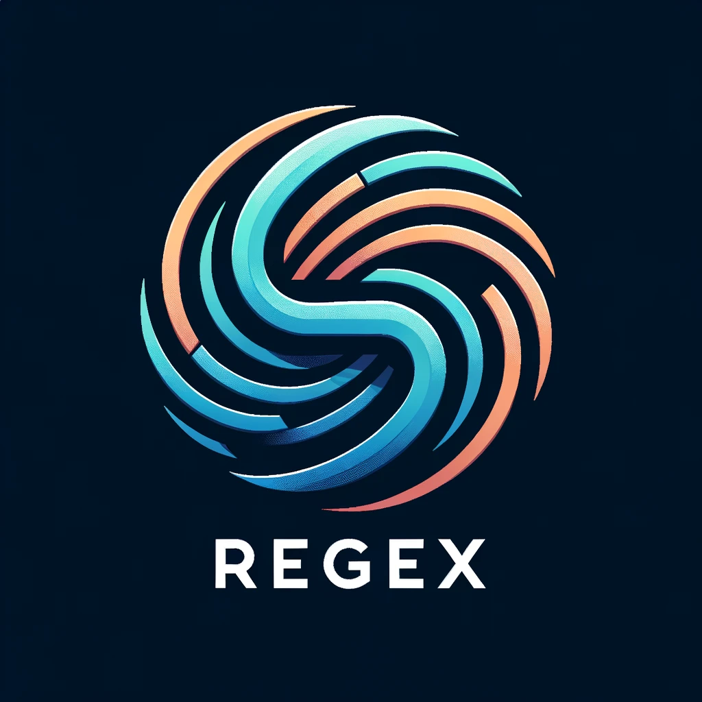
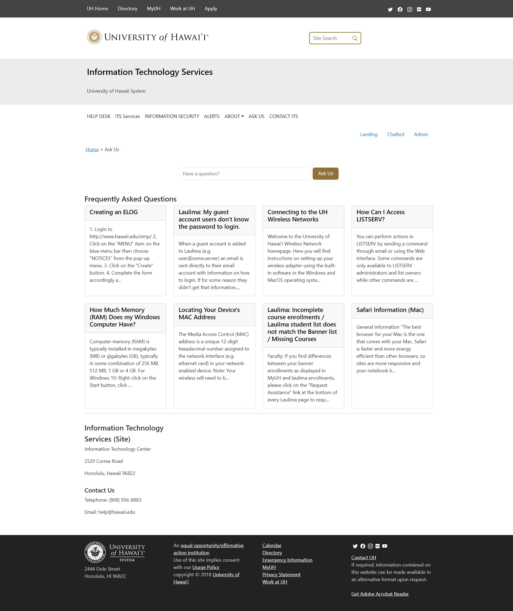
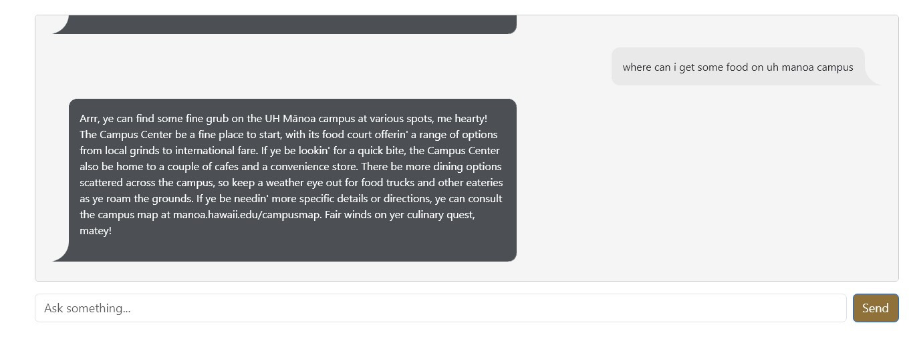
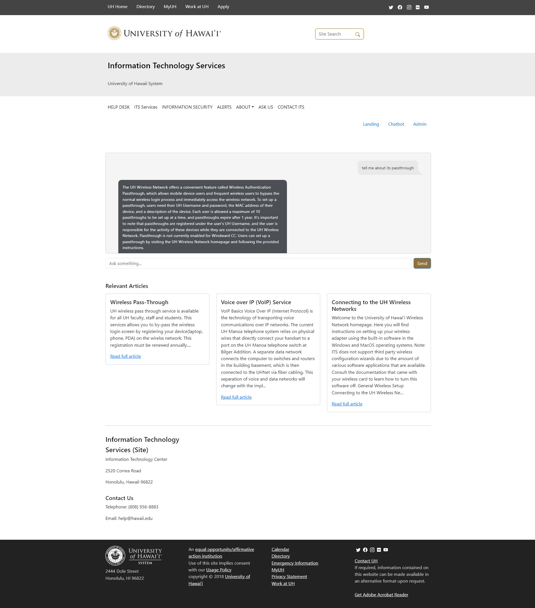
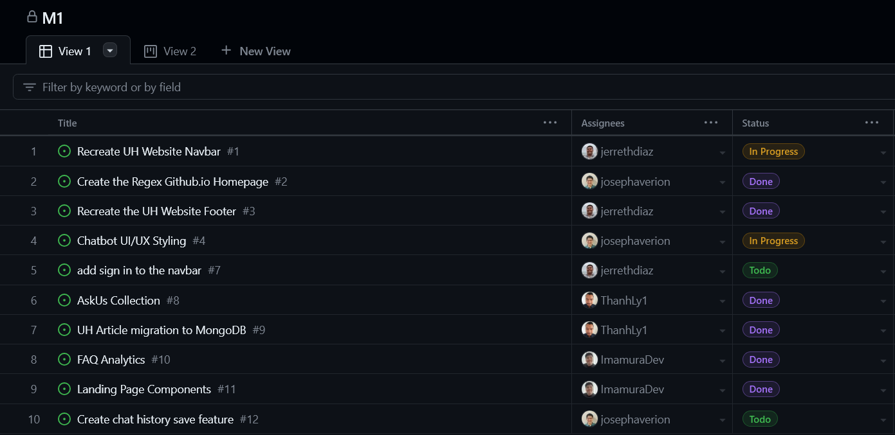

# UH ITS Ask Us AI Chatbot

## Table of Contents
- [Project Overview](#project-overview)
- [Solution Approach](#solution-approach)
- [Features](#features)
- [User Interface](#user-interface)
- [Use Cases](#use-cases)
- [Deployment](#deployment)
- [Development Milestones](#development-milestones)
- [Team Members](#team-members)
- [Project Contract](#project-contract)

## Project Overview
The UH ITS Ask Us AI chatbot aims to transform the user experience on the Ask Us page by providing a virtual assistant capable of intelligently navigating a database of articles to answer user inquiries. This enhancement streamlines the information retrieval process, offering a more efficient and user-friendly interaction.

## Solution Approach
Leveraging the OpenAI API, our chatbot is trained to interpret and extract pertinent information from the ITS Ask Us database articles. By synthesizing content from these articles, the chatbot can address queries with information that may not be explicitly detailed within the articles themselves, showcasing a nuanced understanding and application of the knowledge base.

## Features
- **AI Chatbot**: Designed to comprehend and utilize database articles to respond to user queries.
- **Admin Page**: Allows administrators to manage the article database and view analytics on chatbot performance.

## User Interface

### Landing Page

### Chatbot

## Use Cases
- **User**: Interact with the AI chatbot via an input bar, receive answers along with relevant article links, and provide feedback on the chatbot's performance.
- **Admin**: Access additional admin functionalities such as chatbot data analytics and article database management.

## Deployment
The AskUs chatbot is deployed on Digital Ocean. Access the live application [here](#).

## Development Milestones
###  **Milestone 1**: 
-  (Thanh, please add this screenshot)
###  **Milestone 2**:

###  **Milestone 3**:

## Team Members
- Devin I.
- Jerreth D.
- Joseph A.
- Thanh L.

## Project Contract
[View our project contract](https://docs.google.com/document/d/1Tsaz6w-svai7B1M3a89E4jiB4L6JRUC6Z5HFz9JLC4Q/edit?usp=sharing)
